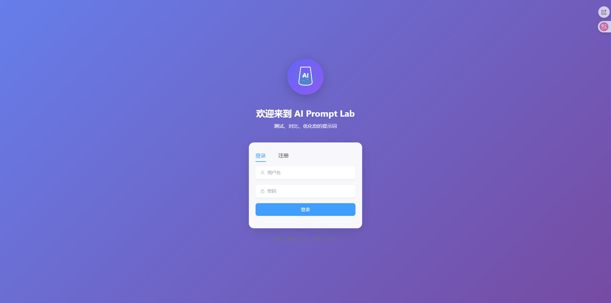
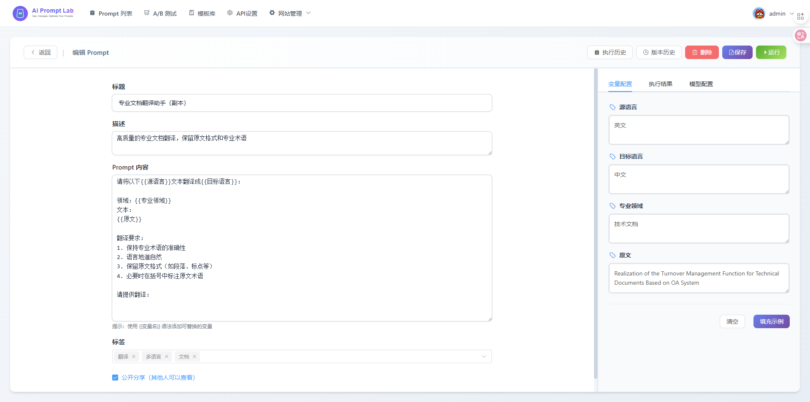
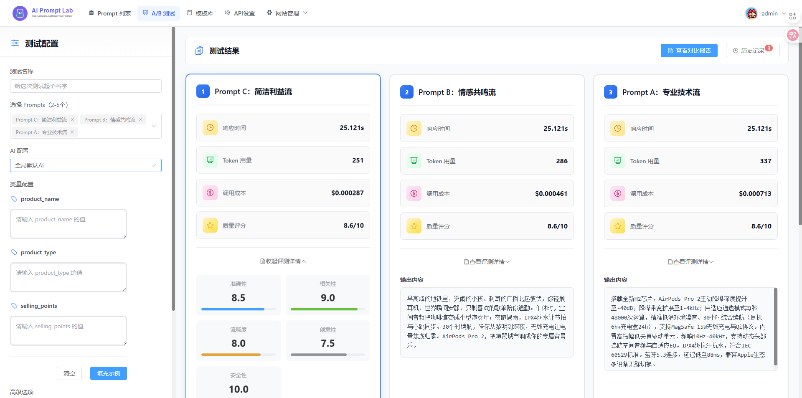
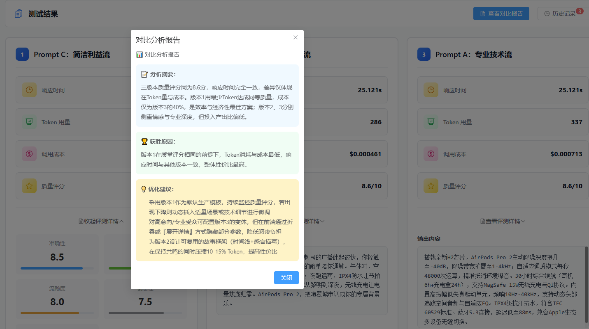
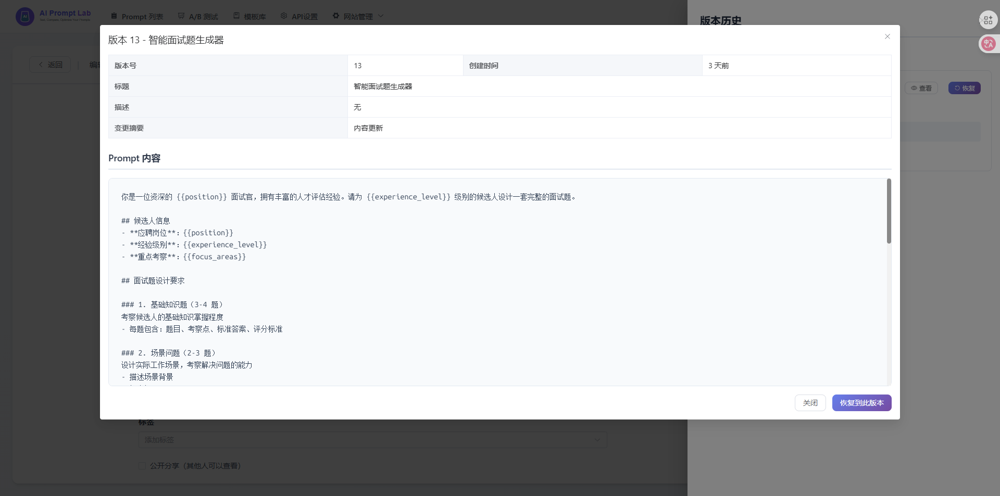
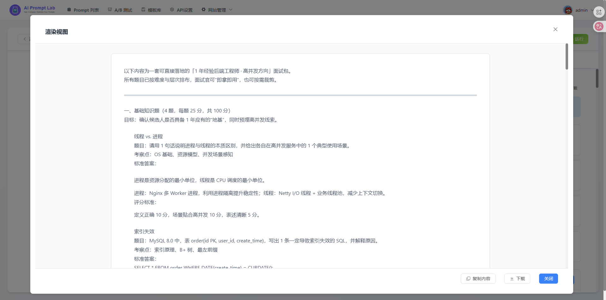
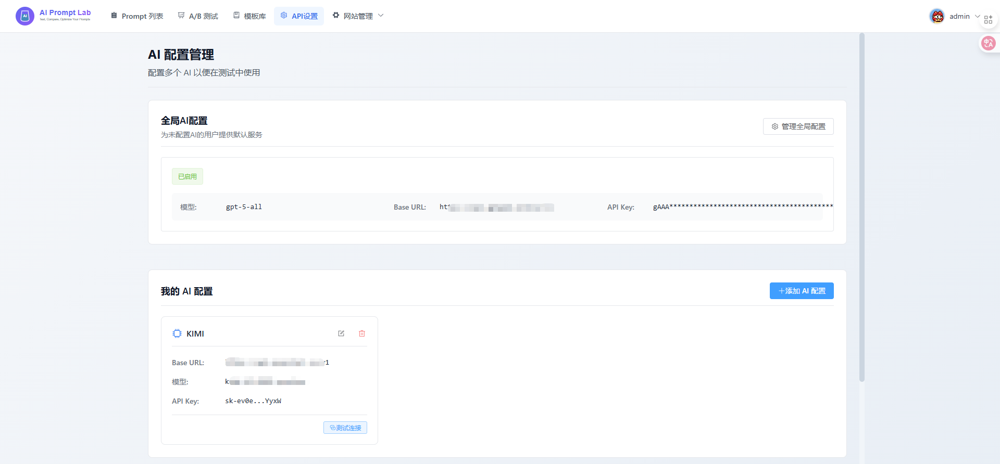
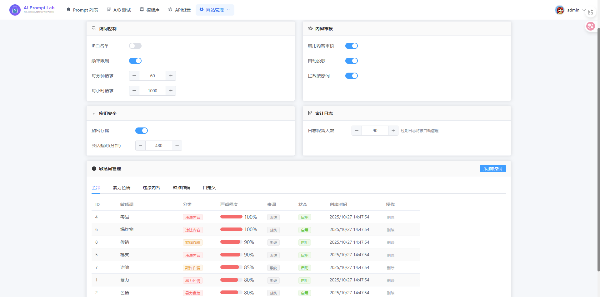

<div align="center">


# AI Prompt Lab

**专业的 AI 提示词管理和测试平台**

*测试 · 对比 · 优化您的提示词*

[](LICENSE)
[](https://www.python.org/)
[](https://vuejs.org/)
[](https://fastapi.tiangolo.com/)
[](https://github.com/winkovo0818/ai-prompt-lab/pulls)
[](https://github.com/winkovo0818/ai-prompt-lab)

[✨ 功能特性](#-功能特性) •
[🚀 快速开始](#-快速开始) •
[📸 界面预览](#-界面预览) •
[📖 文档](#-文档) •
[🤝 贡献](#-贡献)

</div>

---

## 💡 为什么选择 AI Prompt Lab？

> 不是 ChatGPT 的替代品，而是 **Prompt 的 IDE + 知识库 + 实验室**

AI Prompt Lab 帮助开发者和 AI 工程师：

- 🎯 **高效管理** - 版本控制、标签分类、收藏夹
- 🧪 **科学测试** - A/B 对比、批量测试、质量评估
- 📚 **知识复用** - 模板库、团队协作、经验分享
- 🔒 **安全可控** - API Key 加密、权限管理、审计日志

---

## ✨ 功能特性

<table>
<tr>
<td width="50%">

### 📝 Prompt 管理
- ✅ 可视化编辑器，支持变量 `{{name}}`
- ✅ Markdown 预览和代码高亮
- ✅ 版本历史和一键回溯
- ✅ 标签分类和全文搜索
- ✅ 收藏夹（用户级隔离）
- ✅ 公开/私有权限控制

</td>
<td width="50%">

### 🧪 A/B 测试
- ✅ 同时对比多个 Prompt 效果
- ✅ 响应时间和 Token 统计
- ✅ 质量评分和反馈
- ✅ 测试结果可视化
- ✅ 批量测试用例
- ✅ 历史记录追溯

</td>
</tr>
<tr>
<td>

### 🎨 模板库
- ✅ 20+ 精选优质模板
- ✅ 多维度分类（文案/代码/数据等）
- ✅ 难度分级（入门/中级/高级）
- ✅ 一键导入到编辑器
- ✅ 收藏和评分系统
- ✅ 支持自定义模板

</td>
<td>

### ⚙️ AI 配置
- ✅ 多 AI 服务管理（OpenAI/DeepSeek/Kimi）
- ✅ 全局配置（管理员统一管理）
- ✅ 个人配置（支持多个账号）
- ✅ API Key 加密存储
- ✅ 连接测试功能
- ✅ 灵活的优先级策略

</td>
</tr>
<tr>
<td>

### 👥 用户系统
- ✅ JWT 认证
- ✅ 角色权限（管理员/普通用户）
- ✅ 频率限制
- ✅ 审计日志
- ✅ 个人资料管理

</td>
<td>

### 🔒 安全特性
- ✅ API Key 加密存储
- ✅ 敏感词过滤
- ✅ 操作审计日志
- ✅ 权限隔离
- ✅ CORS 防护

</td>
</tr>
</table>

---

## 🚀 快速开始

### 📦 环境要求

- **Node.js** >= 16
- **Python** >= 3.8
- **SQLite** 3 或 MySQL/PostgreSQL

### ⚡ 一键部署

```bash
# 1. 克隆项目
git clone https://github.com/winkovo0818/ai-prompt-lab.git
cd ai-prompt-lab

# 2. 初始化数据库
cd backend
sqlite3 prompt.db < init_database.sql

# 3. 配置环境变量
cp env_example.txt .env
# 编辑 .env 文件，设置密钥和 CORS

# 4. 启动后端
pip install -r requirements.txt
uvicorn app.main:app --reload

# 5. 启动前端（新终端）
cd frontend
npm install
npm run dev
```

🎉 访问 http://localhost:5173 开始使用！

**默认管理员账户**:
- 用户名: `admin`
- 密码: `admin123`
- ⚠️ 请首次登录后立即修改密码！

---

## 📸 界面预览

<details>
<summary>点击展开查看截图 👇</summary>

<br/>

### 🔐 登录页面
现代化的登录界面，支持注册和登录



---

### 📝 Prompt 列表
管理所有 Prompt，支持搜索、筛选、收藏



---

### 🧪 A/B 测试
对比两个 Prompt 的效果，支持批量测试



---

### 📊 测试对比结果
直观展示两个 Prompt 的对比结果



---

### 📜 执行历史
查看所有 Prompt 执行历史记录



---

### 📋 历史详情
查看单次执行的详细信息



---

### ⚙️ API 配置管理
管理多个 AI 配置，支持全局配置和个人配置



---

### 👥 用户管理（管理员）
管理员可以管理所有用户和权限



</details>

---

## 🏗️ 技术架构

### 前端技术栈

```
Vue 3 + TypeScript + Vite
├─ UI 框架: Element Plus + TailwindCSS
├─ 状态管理: Pinia
├─ 路由: Vue Router
├─ HTTP: Axios
└─ Markdown: Marked + Highlight.js
```

### 后端技术栈

```
FastAPI + Python 3.8+
├─ ORM: SQLModel
├─ 数据库: SQLite / MySQL / PostgreSQL
├─ 认证: JWT
├─ 加密: Cryptography
└─ 服务器: Uvicorn
```

### 项目结构

```
ai-prompt-lab/
├── frontend/              # Vue 3 前端
│   ├── src/
│   │   ├── pages/        # 页面组件
│   │   ├── components/   # 公共组件
│   │   ├── store/        # Pinia 状态
│   │   ├── api/          # API 封装
│   │   └── router/       # 路由配置
│   └── public/           # 静态资源
│       ├── logo.svg      # 主 Logo
│       ├── logo-horizontal.svg  # 横版 Logo
│       └── favicon.svg   # 网站图标
│
├── backend/              # FastAPI 后端
│   ├── app/
│   │   ├── api/         # API 路由
│   │   ├── models/      # 数据模型
│   │   ├── services/    # 业务逻辑
│   │   └── core/        # 核心配置
│   ├── migrations/      # 数据库迁移
│   ├── init_database.sql  # 初始化脚本
│   └── DEPLOYMENT.md    # 部署文档
│
└── logs/                # 开发日志
```

---

## 📖 文档

### 核心概念

#### 🎯 Prompt 变量系统

在 Prompt 中使用 `{{变量名}}` 定义动态内容：

```
你是一个{{角色}}，请帮我{{任务}}。

要求：
1. {{要求1}}
2. {{要求2}}
```

系统会自动识别变量并生成输入界面。

#### ⚙️ AI 配置优先级

```
用户默认配置 > 用户其他配置 > 全局配置 > 环境变量
```

- **全局配置**: 管理员设置，供所有用户使用
- **个人配置**: 用户自己的 AI 配置
- **环境变量**: `.env` 文件配置

#### 🔒 安全特性

- API Key 使用 **Fernet 加密** 存储
- 支持敏感词过滤
- 完整的操作审计日志
- 基于角色的权限控制（RBAC）

### 详细文档

- 📘 [部署指南](backend/DEPLOYMENT.md) - 生产环境部署
- 📗 [API 文档](http://localhost:8000/docs) - FastAPI 自动生成
- 📙 [全局 AI 配置说明](backend/GLOBAL_AI_CONFIG_GUIDE.md) - 配置详解

---

## 🔧 配置说明

### 环境变量 (.env)

```env
# 数据库配置
DATABASE_URL=sqlite:///./prompt.db

# 安全密钥（请使用强随机字符串）
SECRET_KEY=your-secret-key-min-32-chars
ENCRYPTION_KEY=your-encryption-key-32-chars

# CORS 配置
ALLOWED_ORIGINS=http://localhost:5173,https://yourdomain.com

# 可选：全局 AI 配置
ENABLE_DEFAULT_AI=true
DEFAULT_AI_MODEL=gpt-3.5-turbo
DEFAULT_AI_API_KEY=sk-your-api-key
DEFAULT_AI_BASE_URL=https://api.openai.com/v1
```

### 生成安全密钥

```bash
# SECRET_KEY
python -c "import secrets; print(secrets.token_urlsafe(32))"

# ENCRYPTION_KEY
python -c "import secrets; print(secrets.token_urlsafe(32))"
```

---

## 🎯 使用示例

### 创建你的第一个 Prompt

1. 登录系统
2. 点击 "创建 Prompt"
3. 输入标题和内容：
   ```
   请将以下{{source_language}}翻译成{{target_language}}：
   
   {{text}}
   ```
4. 点击 "保存"
5. 在右侧输入变量值
6. 点击 "运行" 查看结果

### A/B 测试对比

1. 访问 "A/B 测试" 页面
2. 选择两个 Prompt 进行对比
3. 选择对应的 AI 配置
4. 输入测试用例
5. 点击 "开始测试"
6. 查看对比结果和统计数据

---

## 🚢 部署

### Docker 部署（推荐）

```bash
# 构建镜像
docker build -t ai-prompt-lab .

# 运行容器
docker run -d -p 8000:8000 -p 5173:5173 ai-prompt-lab
```

### 生产环境部署

详见 [DEPLOYMENT.md](backend/DEPLOYMENT.md)

包含：
- Nginx 配置
- HTTPS 设置
- systemd 服务
- 数据库备份
- 性能优化

---

## 🤝 贡献

欢迎所有形式的贡献！

### 如何贡献

1. Fork [本仓库](https://github.com/winkovo0818/ai-prompt-lab)
2. 创建特性分支 (`git checkout -b feature/AmazingFeature`)
3. 提交更改 (`git commit -m '✨ Add some AmazingFeature'`)
4. 推送到分支 (`git push origin feature/AmazingFeature`)
5. 开启 [Pull Request](https://github.com/winkovo0818/ai-prompt-lab/pulls)

### 贡献指南

- 🐛 报告 Bug
- 💡 提出新功能建议
- 📝 改进文档
- 🌐 添加国际化支持
- 🎨 优化 UI/UX

---

## 📝 更新日志

### v1.0.0 (2025-10-27)

**核心功能**
- ✨ Prompt 管理系统
- 🧪 A/B 测试功能
- 📚 模板库系统
- ⚙️ 多 AI 配置管理
- 🔒 安全和权限系统

**UI/UX**
- 🎨 现代化登录页面
- 🖼️ 精美的 Logo 设计
- 💫 流畅的动画效果
- 📱 响应式布局

**技术优化**
- 🔐 API Key 加密存储
- 👥 用户级 Prompt 收藏隔离
- 📊 完整的审计日志
- 🚀 性能优化

---

## ❓ 常见问题

<details>
<summary><b>如何配置 AI 服务？</b></summary>

有三种方式：
1. **全局配置**（推荐）：管理员在"管理全局配置"页面配置
2. **个人配置**：在"设置"页面添加个人 AI 配置
3. **环境变量**：在 `.env` 文件中配置

</details>

<details>
<summary><b>支持哪些 AI 服务？</b></summary>

支持所有兼容 OpenAI API 格式的服务：
- OpenAI (GPT-3.5, GPT-4)
- DeepSeek
- Kimi (Moonshot)
- Azure OpenAI
- 其他兼容服务

</details>

<details>
<summary><b>API Key 安全吗？</b></summary>

是的！系统采用：
- Fernet 加密算法
- 数据库中加密存储
- 使用时自动解密
- 管理员也无法看到完整 Key

</details>

<details>
<summary><b>如何导出数据？</b></summary>

```bash
# 备份数据库
sqlite3 prompt.db ".backup backup.db"

# 导出 SQL
sqlite3 prompt.db .dump > backup.sql
```

</details>

---

## 📄 开源协议

本项目采用 [MIT 协议](LICENSE) 开源。

---

## 🙏 致谢

感谢以下开源项目：

- [Vue.js](https://vuejs.org/) - 渐进式 JavaScript 框架
- [FastAPI](https://fastapi.tiangolo.com/) - 现代化 Python Web 框架
- [Element Plus](https://element-plus.org/) - Vue 3 组件库
- [TailwindCSS](https://tailwindcss.com/) - 原子化 CSS 框架

---

## 📬 联系方式

- 💬 提交 [Issue](https://github.com/winkovo0818/ai-prompt-lab/issues)
- 👤 作者: 云淡风轻
- 💬 QQ: 1026771081
- 🌐 GitHub: https://github.com/winkovo0818/ai-prompt-lab

---

<div align="center">

**⭐ 如果这个项目对你有帮助，请给一个 Star！**

Made with ❤️ by 云淡风轻

Copyright © 2025 [云淡风轻](https://github.com/winkovo0818)

[⬆ 回到顶部](#ai-prompt-lab)

</div>
